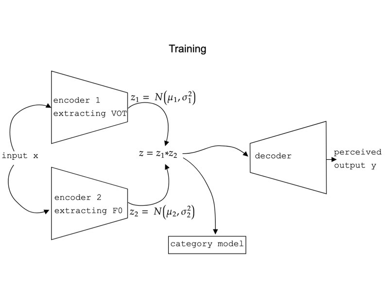

# Adaptation to speech in noise through selective attention

This repository contains the code for simulating the computational experiment of modeling speech adaptation.

This experiment modeled how human listeners can flexibly weight the speech features according to their reliability, such that they can adapt to any environment or speaker. The structure of the model is a $\beta$-ME-VAE (multiple encoder auto encoder). The encoders' information is probabilistically weighted to simulate the fact that listeners rely more on some features than the other in specific situations. The human behavior modeled in this project is .

 

The dependencies needed to run this code: 
`tensorflow` 
`keras` 
`itertools` 
`scipy` 
`sklearn` 
`numpy` 
`pandas` 
`matplotlib` 

To run the entire experiment, run:
`python main.py`

The flags/arguments are set by default as those used in the experiment. You can manually change them:

optional arguments:  
` -h, --help           `  
&emsp; &emsp;  show this help message and exit  
` -t {True,False}, --train {True,False} `  
&emsp; &emsp;  train the model from scratch; if false will load weights
` -p PATH, --path PATH`  
&emsp; &emsp;  name the path for saving or loading model weights
` -e NUM_EPOCHS, --num_epochs NUM_EPOCHS`  
&emsp; &emsp;  number of epochs to train the model
` -bs BATCH_SIZE, --batch_size BATCH_SIZE`  
&emsp; &emsp;  batch size for training  
` -l LATENT, --latent LATENT `  
&emsp; &emsp;  vae latent dimension size  
` -d CAT_DIM, --cat_dim CAT_DIM `  
&emsp; &emsp;  dimension of the category outcome  
` -c CAT_SIZE, --cat_size CAT_SIZE `  
&emsp; &emsp;  number of the decision model units  
` -b BETA, --beta BETA `  
&emsp; &emsp;  value of parameter beta (multiplied with KL divergence)   
` -w WEIGHT, --weight WEIGHT `  
&emsp; &emsp;  weight of the upweighted feature, downweighted feature is 1-w 
` -lr LEARNING_RATE, --learning_rate LEARNING_RATE `  
&emsp; &emsp;  learning rate of the vae  
` -v {True,False}, --variance {True,False} `  
&emsp; &emsp;  variance on one of the dimensions of the input - for each encoder, the variance is set on one unique dim  
` -s SEED, --seed SEED `  
&emsp; &emsp;  random seed for generating data  
` -pe PER_ENC1, --per_enc1 PER_ENC1 `  
&emsp; &emsp;  percentage of encoder 1 for weighting the information from the decision model; percentage of encoder 2 is 1-per_enc1  
` -pd {True,False}, --plot_data {True,False} `  
&emsp; &emsp;  plot the data?  
` -ad {True,False}, --analyze_data {True,False} `  
&emsp; &emsp;  analyze the data?

To run just the analysis and plot the data with an already trained model, run:
`python main.py -t=False`

To bypass plotting the data:
`python main.py -pd=False`

